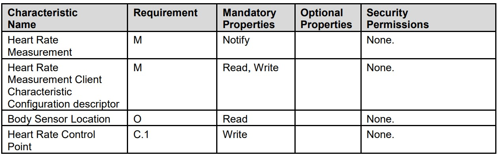

# bsal层实现HRS和Sample

> BSAL （Bluetooth Stack Abstract Layer）软件包是由 RT-Thread 针对不同 蓝牙协议栈接口实现的，目前支持的 协议栈有：nimble，realtek 等协议栈。
>
> 本文将参考 bsal 的 [bas profile](https://github.com/RT-Thread-packages/bsal/tree/main/profiles/service/basl_bas)，[ble_bas_only_app](https://github.com/RT-Thread-packages/bsal/blob/main/samples/ble_bas_only_app.c)，[nimble 的 hrs sample](https://github.com/RT-Thread-packages/nimble/blob/master/apps/blehr/src/gatt_svr.c) ，[blehr](https://github.com/RT-Thread-packages/nimble/blob/master/apps/blehr/src/blehr.c)实现 bsal 层的 HRS。
>
> 还需要手机安装 nrf_connect，抓包分析辅助开发，[参考](https://supperthomas-wiki.readthedocs.io/en/latest/03_xupenghu/04_btsnoop_hci/android_hci.html)。
>
> [相关commit](https://github.com/WaterFishJ/bsal/commit/84bfc2b3183b619095c37be8ad28971dab68a0f8)

### 一、设计路线

整体分开两个 .c 文件和一个 .h 文件：profile 文件（bsal_srv_hrs.c，bsal_srv_hrs.h）和 app （ble_hrs_app.c）文件。

实现 HRS 要做的事情其实不多：

- **profile 文件中需要：**①构造 profile；②实现 profile_callback 函数；③实现发送数据函数；

- **app 文件中需要：**①初始化协议栈并注册 profile，②实现协议栈 callback函数，③实现应用层上的 app_profile_callback 函数


### 二、各部分实现

#### 2.1 profile 文件

##### 2.1.1 构造 profile

参考[SPEC](https://www.bluetooth.com/specifications/specs/heart-rate-service-1-0/)：



由此可见，前两项是强制要求有的特性，后两项是可选的。

参考[nimble 的 hrs sample](https://github.com/RT-Thread-packages/nimble/blob/master/apps/blehr/src/gatt_svr.c)：

```c
static const struct ble_gatt_svc_def gatt_svr_svcs[] = {
    {
        /* Service: Heart-rate */
        .type = BLE_GATT_SVC_TYPE_PRIMARY,
        .uuid = BLE_UUID16_DECLARE(GATT_HRS_UUID),
        .characteristics = (struct ble_gatt_chr_def[]) { {
            /* Characteristic: Heart-rate measurement */
            .uuid = BLE_UUID16_DECLARE(GATT_HRS_MEASUREMENT_UUID),
            .access_cb = gatt_svr_chr_access_heart_rate,
            .val_handle = &hrs_hrm_handle,
            .flags = BLE_GATT_CHR_F_NOTIFY,
        }, {
            /* Characteristic: Body sensor location */
            .uuid = BLE_UUID16_DECLARE(GATT_HRS_BODY_SENSOR_LOC_UUID),
            .access_cb = gatt_svr_chr_access_heart_rate,
            .flags = BLE_GATT_CHR_F_READ,
        }, {
            0, /* No more characteristics in this service */
        }, }
    }
```

该 sample 中，添加了心率测量和传感器位置两个特性，其中心率测量特性是通知型的，传感器位置特性是可读型的。这似乎和 SPEC 有出（即便是 nrodic 官方 sample 也没有客户端特性配置描述符这个特性），但我们还是按照这个 sample 来。

首先，我们复制 [bas profile](https://github.com/RT-Thread-packages/bsal/tree/main/profiles/service/basl_bas) 中 bsal_le_bas_svr_init 函数，以此函数为模板，修改成 HRS 的 profile，也就是将其中的 .type, .uuid, .characteristics, .properties, .permission 等等参数，参考 SPEC 和 nimble 修改成 HRS 的参数：

```c
void bsal_le_hrs_svr_init(void *stack_ptr, void *app_callback)
{
    struct bsal_gatt_app_srv_def ble_svc_hrs_defs[] =
    {
        {
            /*** Heart Rate Service. */
            .type = BSAL_GATT_UUID_PRIMARY_SERVICE,
            .uuid = BSAL_UUID16_DECLARE(GATT_UUID_HEART_RATE),
            .characteristics = (bsal_gatt_chr_def_t[])
            {
                {
                    /*** Heart Rate Measurement characteristic */
                    .uuid = BSAL_UUID16_DECLARE(GATT_UUID_HRS_MEASUREMENT),
                    .properties = BSAL_ATT_P_NOTIFY,
                    .val_handle = &hrs_hrm_handle,
                    .permission = BSAL_GATT_PERM_READ_NONE,
                    .value_length = 1,
                },
                {
                    /*** Body Sensor Location characteristic */
                    .uuid = BSAL_UUID16_DECLARE(GATT_UUID_CHAR_BODY_SENSOR_LOCATION),
                    .properties = BSAL_ATT_P_READ,
                    .val_handle = &hrs_hrm_handle,
                    .permission = BSAL_GATT_PERM_READ_NONE,
                    .value_length = 1,
                },
                {
                    0, /* No more characteristics in this service. */
                }
            },
        },
        {
            0, /* No more services. */
        },
    };
    bsal_stack_le_srv_reg_func(stack_ptr, &ble_svc_hrs_defs, (P_SRV_GENERAL_CB *)hrs_profile_callback);
    pfn_bas_cb = (P_SRV_GENERAL_CB)app_callback;
}
```

各参数的宏定义在 [bsal_sig.h](https://github.com/RT-Thread-packages/bsal/blob/main/inc/bsal_sig.h) 中找到，并在 bsal_srv_hrs.h 文件中再定义一次：

```c
#define GATT_UUID_HEART_RATE                       BSAL_GATT_SERVICE_HEART_RATE
#define GATT_UUID_HRS_MEASUREMENT                  BSAL_UUID_CHAR_HEART_RATE_MEASUREMENT
#define GATT_UUID_CHAR_BODY_SENSOR_LOCATION        BSAL_UUID_CHAR_BODY_SENSOR_LOCATION
```


##### 2.1.2 实现 profile_callback 函数

同样，我们复制 [bas profile](https://github.com/RT-Thread-packages/bsal/tree/main/profiles/service/basl_bas) 中 profile_callback 函数，以此为模板修改成 HRS 的profile_callback 函数。

HRS 中，我们要处理三种 msg_type：读，写（因为参考的 nimble sample 没有写，所以可以不处理）和 CCCD 更新。

- **读类型：**当一个服务中有多个可读特性时，需要判断本次读的特性是哪一个。我们的 HRS 则需要判断是否为“传感器位置”这个特性，若是则发送传感器位置数据。
- **写类型：**同理，需要做判断。但我 HRS 没有需要写的特性，因此不做处理。
- **CCCD更新类型：**同理，需要判断是哪个特性需要更新 CCCD。我们的 HRS 则需要判断是否为“心率测量”这个特性。

```c
static uint8_t body_sens_loc = BODY_SENSOR_LOCATION_CHEST;
static P_SRV_GENERAL_CB pfn_bas_cb = NULL;
static void hrs_profile_callback(void *p)
{
    bsal_callbak_data_t *p_param = (bsal_callbak_data_t *)p;
    bool is_app_cb = false;

    if (p_param->msg_type == BSAL_CALLBACK_TYPE_READ_CHAR_VALUE)
    {
        if (GATT_SVC_BODY_SENSOR_LOCATION_READ_INDEX == p_param->off_handle)
        {
            is_app_cb = true;
            bsal_srv_write_data(p_param->stack_ptr, p_param->start_handle, p_param->off_handle, sizeof(uint8_t), &body_sens_loc);
        }
    }
    else if (p_param->msg_type == BSAL_CALLBACK_TYPE_WRITE_CHAR_VALUE)
    {
        is_app_cb = true;
    }
    else if (p_param->msg_type == BSAL_CALLBACK_TYPE_INDIFICATION_NOTIFICATION)
    {
        if (GATT_SVC_HRS_MEASUREMENT_CHAR_CCCD_INDEX == p_param->off_handle)
        {
            if (p_param->length == 2)
            {
                is_app_cb = true;
            }
        }
    }
    if (is_app_cb && (pfn_bas_cb != NULL))
    {
        pfn_bas_cb(p_param);
    }
}
```

其中，判断所需要的几个宏定义，在 bsal_srv_hrs.h 中定义：

```c
#define GATT_SVC_BODY_SENSOR_LOCATION_READ_INDEX    5
#define GATT_SVC_HRS_MEASUREMENT_CHAR_INDEX         2
#define GATT_SVC_HRS_MEASUREMENT_CHAR_CCCD_INDEX    3
```

这几个 index 实际是指各特性在 HRS 中的偏移量，这个可以通过抓包 nimble sample 看到，比如“传感器位置”这个特性的 handle 为6，则偏移量为5（handle - start handle）。

还有一个传感器位置的宏定义，在bsal_srv_hrs.h 中定义：

```c
#define BODY_SENSOR_LOCATION_CHEST                  0x01
```


##### 2.1.3 实现发送数据函数

bas 中也有类似需要发送通知型特性的数据的函数，我们复制过来作为模板。

因为这条函数的功能是通过协议栈向设备发送心率测量数值，所以这条函数的入口参数需要有协议栈指针（void *stack_ptr），连接设备的 id（uint16_t conn_id） 和需要发送的数值（uint8_t *hr_measurement）。

因为协议栈中可能会有多个 Service，所以我们要查找到 HRS 在协议栈中的位置（start_handle）；同理，HRS 中有许多不同的特性，我们要选择心率测量这个特性，即找到特性在 HRS 中的偏移量（index宏定义）；最后根据 HRS 在协议栈中的位置（start_handle），和心率测量特性在 HRS 中的偏移量（index宏定义），向连接的设备（conn_id），发送数值（hr_measurement）：

```c
void bsal_hrs_send_notify_level(void *stack_ptr, uint16_t conn_id,  uint8_t *hr_measurement)
{
    bsal_uuid_any_t uuid_srv;
    uuid_srv.u_type = 16;
    uuid_srv.u16.value = GATT_UUID_HEART_RATE;
    uint16_t start_handle = bsal_srv_get_start_handle(stack_ptr, uuid_srv);
    bsal_srv_send_notify_data(stack_ptr, conn_id, start_handle, GATT_SVC_HRS_MEASUREMENT_CHAR_INDEX, sizeof(hr_measurement), hr_measurement);
}
```


##### 2.1.4 完善头文件

将 app 需要用到的两条函数加进去：

```c
void bsal_le_hrs_svr_init(void *stack_ptr, void *app_callback);

void bsal_hrs_send_notify_level(void *stack_ptr, uint16_t conn_id,  uint8_t *hr_measurement);
```


#### 2.2 app文件

##### 2.2.1 初始化协议栈并注册 profile

在此之前先实现一条 loop 函数，这条函数是用来不断修改心率测量数据，并发送心率测量数据的。

根据[SPEC](https://www.bluetooth.com/specifications/specs/heart-rate-service-1-0/)，心率测量数据有四个数据，一个 flag 数据，一个心率数据，一个能量消耗数据和一个 RR间隔。从心率测量的功能上来看，前两个数据是必须要的。

其中，flag 数据包含了：

- 心率值格式位：第0位为0，则表示以 uint8 格式发送心率数值；第0位为1，则表示以 uint16 格式发送心率数值。
- 传感器接触状态位：第2位为0，则表示不支持传感器状态测量，为1则表示支持；若支持，则第1位为0时，表示传感器未接触或接触不良，为1时，表示传感器接触正常。
- 能量消耗状态位：第3位（略）
- RR间隔位：（略）（主要是SPEC没讲清楚是哪一位）

综上，我们要发送的数据由两个 uint8 组成：一个 flag 和一个心率数据，flag 设置为 0x06（即支持触点状态测量且传感器接触正常）：

```c
static void bsal_ble_loop(void *p_param)
{
    static uint8_t hrm[2];
    hrm[0] = 0x06;
    
    uint8_t heart_rate = 90;
    while (1)
    {
        bsal_osif_delay(1000);
        bsal_osif_printf_info("====hello world===%d=\r\n", heart_rate_flag);
        if (heart_rate_flag == 1)
        {
            if (heart_rate <= 120)
            {
                heart_rate++;
            }
            else
            {
                heart_rate = 90;
            }
            hrm[1] = heart_rate;
            bsal_hrs_send_notify_level(bsal_stack_ptr, bsal_app_conn_handle, hrm);
        }
    }
}
```

然后编写初始化协议栈函数，[ble_bas_only_app](https://github.com/RT-Thread-packages/bsal/blob/main/samples/ble_bas_only_app.c)里的初始化函数复制过来当模板用，只需要将其中 bas 相关的内容改成 hrs 的即可：

```c
int bsal_hrs_app(void)
{
    void *stack_ptr = bsal_find_stack_ptr(BSAL_STACK_NAME);
    if (stack_ptr == NULL)
    {
        //print error;
        return 1;
    }
    
    void *bsal_test_app_task;
    //set iocapability

    bsal_stack_ptr  = stack_ptr;
    
    //1. init stack
    bsal_stack_init(stack_ptr, bsal_app_all_callback);  // init param not start stack   
    // set device name
    char *device_name = "ble_rtt_hrs";
    bsal_set_device_name(stack_ptr, strlen(device_name), (uint8_t *)device_name);
    
    //2. bond type
    bsal_set_device_le_bond_type(stack_ptr, false, BSAL_NO_INPUT, BSAL_NO_OUTPUT, BSAL_GAP_AUTHEN_BIT_NO_BONDING, false);
    //set the bond flag
    
    //3. service begin
    bsal_stack_le_srv_begin(stack_ptr, 1, bsal_app_profile_callback);  //will add 1 service
    
    //4. brs_init
    bsal_le_hrs_svr_init(stack_ptr, bsal_app_profile_callback); //add heart rate servcie

    //5. srv_end
    bsal_stack_le_srv_end(stack_ptr);    //end srv add

    //start stack
    bsal_stack_startup(stack_ptr);    //start she
		
    bsal_test_app_task = rt_thread_create("bsal_app", bsal_ble_loop, NULL, 2 * 256, 5, 10);

    if (bsal_test_app_task != RT_NULL)
    {
        rt_thread_startup(bsal_test_app_task);
    }
    return 0;
}
MSH_CMD_EXPORT_ALIAS(bsal_hrs_app, bsal_hrs_app, "bluetoooth heart rate sample");
```


##### 2.2.2 实现协议栈 callback 函数

协议栈初始化完成后会进入回调函数，可以在回调函数里面开始打广播，但第一次打广播之前需要初始化一个32字节的数据包，因此在回调函数前写一个初始化数据包函数。

同样，此函数在[ble_bas_only_app](https://github.com/RT-Thread-packages/bsal/blob/main/samples/ble_bas_only_app.c)中有，复制过来用就行了：

```c
static void bsa_app_set_adv_data(void *stack_ptr)
{
    uint8_t tmp_data[32] = {0} ; //must be zero
    bsal_le_adv_data_add_flag(tmp_data, BSAL_GAP_ADTYPE_FLAGS_LIMITED | BSAL_GAP_ADTYPE_FLAGS_BREDR_NOT_SUPPORTED);

    char *adv_name = (char *)bsal_get_device_name(stack_ptr);
    bsal_adv_data_add_name(tmp_data, strlen(adv_name), adv_name);
    bsal_set_le_adv_data_user(stack_ptr, tmp_data);
}
```

回调函数中，我们要对触发回调函数的事件进行判断，之前写的[bas_sample分析](https://github.com/WaterFishJ/Summer2021_docs/blob/master/pca10056%E7%9A%84bsal%E5%B1%82bas_sample%E8%A7%A3%E6%9E%90/pca10056%E7%9A%84bsal%E5%B1%82bas_sample%E8%A7%A3%E6%9E%90.md)文档中有相关内容，不再作过多阐述。

回调函数与 bas 的基本一样，因此复制过来，只需要将 bas 相关的内容换成 hrs 即可：

```c
static void bsal_app_all_callback(void *stack_ptr, uint8_t cb_layer, uint16_t cb_sub_event, uint8_t value_length, void *value)
{
    T_BSAL_GAP_MSG_DATA  *bsal_gap_msg_data = (T_BSAL_GAP_MSG_DATA *)value;
    uint8_t bd_addr[6];
    switch (cb_layer)
    {
    case BSAL_CB_LAYER_GAP:
        switch (cb_sub_event)
        {
        case BSAL_CB_STACK_READY:
            //get mac address

            bsal_osif_printf_info("============stack ready===========\r\n");
            bsa_app_set_adv_data(stack_ptr);
            bsal_stack_start_adv(stack_ptr);
            break;
        case BSAL_CB_CONNECT_STATUS:
            bsal_osif_printf_info("============stack connect id %d===========\r\n", bsal_gap_msg_data->gap_conn_state_change.conn_id);
            if (bsal_gap_msg_data->gap_conn_state_change.new_state == BSAL_GAP_CONN_STATE_CONNECTED)
            {
                bsal_app_conn_handle = bsal_gap_msg_data->gap_conn_state_change.conn_id;
            }
            else if (bsal_gap_msg_data->gap_conn_state_change.new_state == BSAL_GAP_CONN_STATE_DISCONNECTED)
            {
                bsal_stack_start_adv(stack_ptr);
                heart_rate_flag = 0;
            }
            bsal_osif_printf_info("BSAL: conn_id %d old_state %d new_state %d, disc_cause 0x%x",
                                  bsal_gap_msg_data->gap_conn_state_change.conn_id, gap_conn_state, bsal_gap_msg_data->gap_conn_state_change.new_state, bsal_gap_msg_data->gap_conn_state_change.disc_cause);

            break;
        default:
            break;
        }

        if (cb_sub_event == BSAL_CB_STACK_READY)
        {
            //stack ready
        }

        break;
    case BSAL_CB_LAYER_GATT_PROFILE:
        switch (cb_sub_event)
        {
            //save the service start_handle
            //case uuid profile save start_handle
            //case SRV_CALLBACK66
            //save the identity
        }
        break;
    case BSAL_CB_LAYER_SM:
        break;
    case BSAL_CB_LAYER_COMMON:
        //connected save the connect id

        break;
    case BSAL_CB_LAYER_UNKNOWN:
        break;
    default:
        break;
    }

}
```


##### 2.2.3 实现应用层上的 app_profile_callback 函数

这条函数在初始化协议栈时，作为入口参数填入了 HRS 初始化函数里：

```c
bsal_le_hrs_svr_init(stack_ptr, bsal_app_profile_callback);
```

在构造 profile 时，成为了一个 profile_callback 回调函数的二级回调函数（这里 app_callback 就是 app_profile_callback 函数）：

```c
pfn_bas_cb = (P_SRV_GENERAL_CB)app_callback;
```

然后在 profile_callback 函数的最后被调用：

```c
    if (is_app_cb && (pfn_bas_cb != NULL))
    {
        pfn_bas_cb(p_param);
    }
```

也就是说，Service 主要功能在回调函数里实现之后，最后再调用这条函数。因此，也需要像 profile_callback 一样去做一些判断。

这条函数更多是为了 app 服务的，因此我们在这里对 CCCD 更新事件进行记录。同样也是复制 bas 里的这条函数，改一下相关参数即可：

```c
static void bsal_app_profile_callback(void *p)
{
    bsal_callbak_data_t *bsal_param = (bsal_callbak_data_t *)p;

    if (bsal_param->msg_type == BSAL_CALLBACK_TYPE_READ_CHAR_VALUE)
    {
        bsal_osif_printf_info("========callback read from %x====%x=======\r\n", bsal_param->off_handle, bsal_param->srv_uuid.u16.value);
    }
    else if (bsal_param->msg_type == BSAL_CALLBACK_TYPE_INDIFICATION_NOTIFICATION)
    {
        uint16_t  cccbits = bsal_param->value;
        bsal_osif_printf_info("======callback notify from %x===data cccd %x====%x=====\r\n", bsal_param->off_handle, cccbits, bsal_param->srv_uuid.u16.value);
        if (bsal_param->srv_uuid.u16.value == GATT_UUID_HEART_RATE)//heart_rate_uuid
        {
            if (cccbits & BSAL_GATT_CCC_NOTIFY)
            {
                bsal_osif_printf_info("=========NOTIFY ENABLE from %x===data cccd %x====%x=====\r\n", bsal_param->off_handle, cccbits, bsal_param->srv_uuid.u16.value);
                heart_rate_flag = 1;
            }
            else
            {
                bsal_osif_printf_info("========NOTIFY DISABLE from %x===data cccd %x====%x=====\r\n", bsal_param->off_handle, cccbits, bsal_param->srv_uuid.u16.value);
                heart_rate_flag = 0;
            }
        }
    }
    else if (bsal_param->msg_type == BSAL_CALLBACK_TYPE_WRITE_CHAR_VALUE)
    {
        bsal_osif_printf_info("\r\n BSAL: THE DATA IS :%s\r\n", bsal_param->data);
    }
}
```


### 三、总结

本文介绍的实际上是一个基于现有案例移植到 bsal 的过程。整个过程其实一直在找相关参数，并配置，所以移植难度并不高。参照此过程，我们可以将更多 Service 移植到 bsal。有了 bsal 层，使得 app 更具有通用性、可移植性。