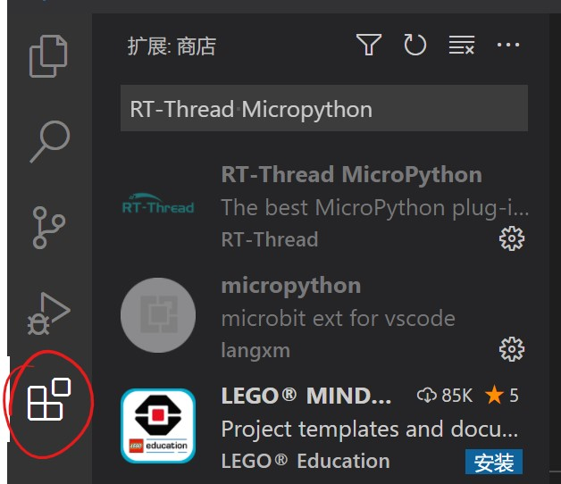

# pca10056的MicroPython固件ble例程测试

### 一、简介

本文将借mpy官方ubluepy的sample，介绍如何使用RT-Thread MicorPython IDE，调试开发MicroPython。


### 二、在VSCode安装RT-Thread MicorPython插件

1. 打开VSCode，在扩展中搜索：RT-Thread Micropython，安装插件并启用。

   

   

2. 关闭VSCode，并重新打开。此时插件将加载。


### 三、创建mpy工程并连接pca10056

1. 点击VSCode左下角的小加号

   

   选择 创建新的MicroPython工程 -> 创建一个空白MicroPython工程，输入工程名“ubluepy”，并输入一个目录，以创建一个mpy工程。

2. 将板子连接电脑，点击VSCode左下角的插头符号

   

   选择对应的COM号，连接板子。稍等片刻，连接成功后会在VSCode下方终端显示：

   

   在终端中按 Ctrl + B 将会显示MicroPython信息：

   

   此时，板子已成功连接。

   

### 四、sample测试

1. 将自动创建的main_example.py代码，改成如下代码：

```python
from ubluepy import Scanner, constants
from board import LED
import time


def bytes_to_str(bytes):
    string = ""
    for b in bytes:
        string += chr(b)
    return string


def get_device_names(scan_entries):
    dev_names = []
    for e in scan_entries:
        scan = e.getScanData()
        if scan:
            for s in scan:
                if s[0] == constants.ad_types.AD_TYPE_COMPLETE_LOCAL_NAME:
                    dev_names.append((e, bytes_to_str(s[2])))
    return dev_names


def find_device_by_name(name):
    s = Scanner()
    scan_res = s.scan(100)

    device_names = get_device_names(scan_res)
    for dev in device_names:
        if name == dev[1]:
            return dev[0]

led = LED(1)

while(1):
    led.toggle()
    res = find_device_by_name("mi3")
    if res:
     print("address:", res.addr())
     print("address type:", res.addr_type())
     print("rssi:", res.rssi())
    time.sleep_ms(500)
```

右键，选择 直接在设备上运行该MicroPython文件。此时，板子上的led开始闪烁，则程序开始运行。


2. 手机上安装nRF Connect软件，打开并在ADVERTISER栏新建一个广播者

   

   Display name设置为“mi3”，并注意在Advertising data中选择Complete Local Name。

3. 打开这个广播者

   

   此时，回到VSCode的终端来，板子将会搜索到名为“mi3”的广播者，并打印相关信息在终端中：

   

   至此，ble sample的测试已完成