# pca10056的MicroPython固件编译与烧录

### 一、简介

1. 本文介绍关于如何从micropython（简称mpy）官方源码编译pca10056（nrf52840）固件，烧录固件以及跑通ubluepy模块的例程。

2. 设备环境信息：Win10 + Ubuntu 18.04（VMware）

   使用到的工具：putty，nrfjprog，Jflash Lite


### 二、准备工作

> 1、请提前安装好git。
>
> 2、整个过程涉及几个仓库的git clone操作，请确保网络畅通（能顺利访问GitHub，或把相关clone操作的仓库地址换成gitee的），确保仓库全部正确clone。

#### 2.1 安装gcc-arm-none-eabi

mpy的构建需要用到gcc-arm-none-eabi工具：

```
sudo apt-get install gcc-arm-none-eabi
```


#### 2.2 下载micropython官方源码

在Ubuntu终端执行：

```
git clone https://github.com/micropython/micropython.git
```

将版本tag从master切换成v1.16（可选、推荐）：

```
cd micropython
git checkout -b v1.16 v1.16
```


#### 2.3 构建mpy-cross

构建任何板子的mpy固件都需要先构建mpy-corss：

```
make -C mpy-cross
```

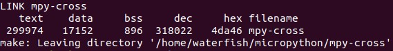


#### 2.4 安装nrfjprog工具（推荐，可选，可先跳过）

J-Link驱动下载地址：https://www.segger.com/downloads/jlink

nrfjprog工具依赖J-Link驱动，因此先安装J-Link驱动。

下载对应版本并安装，我下载的是这个：

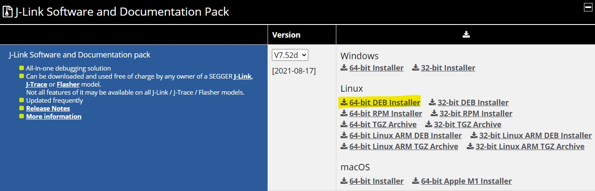

双击安装，或使用命令安装（注意文件名的正确性）：

```
sudo dpkg -i JLink_Linux_V752d_x86_64.deb
```


nrfjprog下载地址：https://www.nordicsemi.com/Products/Development-tools/nrf-command-line-tools/download

选择对应的版本下载（我选的是10.13.0 Linux64），并解压出以下三个文件：

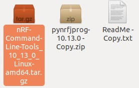

继续解压上图高亮的压缩包，并解压出以下文件：

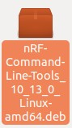

双击安装，或使用命令安装（注意文件名的正确性）：

```
sudo dpkg -i nRF-Command-Line-Tools_10_13_0_Linux-amd64.deb
```


### 三、开始构建pca10056固件

#### 3.1 进入到 ports/nrf 文件夹

```
cd ports/nrf
```


#### 3.2 下载相关依赖仓库

```
make submodules
```

请保证网络顺畅（能顺利访问GitHub），并确保以上命令正确完成。可多次重复尝试以上命令：

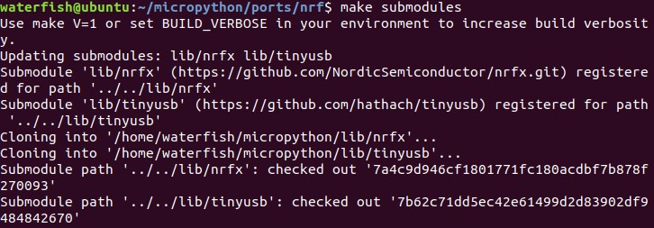

该命令实际上是将两个仓库：nrfx 和 tinyusb 克隆到 mpy/lib 文件夹下。因此，如果实在是网络不行，可以到lib文件夹下分别clone这两个仓库，同时将这两个仓库的地址更换为gitee仓库地址。[通过Gitee克隆仓库加速GitHub下载](https://blog.csdn.net/u013956462/article/details/108551928)


#### 3.3 下载NRF Softdevice 蓝牙协议栈

```
./drivers/bluetooth/download_ble_stack.sh
```


#### 3.4 构建mpy固件

```
make BOARD=pca10056 SD=s140
```

执行这一步时，之前没有切换v1.16 tag，仍然使用master版本的同学可能会在程序链接过程报错（看脸），此时需要将构建失败的文件夹删除（在 ports/nrf 文件夹下有 build 开头的文件夹），然后再执行以下命令：

```
make BOARD=pca10056 SD=s140 LTO=0
```

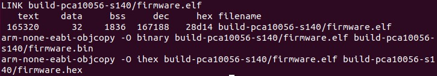


此时，在 ports/nrf 文件夹下的有 build 开头的文件夹便是构建好的mpy固件，里面的firmware.hex便是我们想要的固件

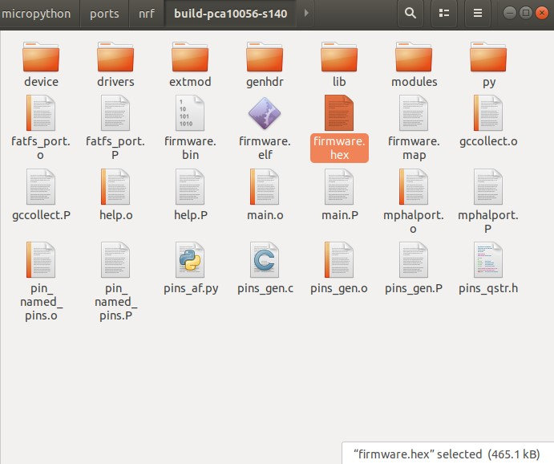


### 四、烧录pca10056固件到板子上

有两种烧录方式：

**1. 使用nrfjprog工具烧录（推荐）**

- 安装nrfjprog工具（2.4节）

- 在构建之前（执行3.4节之前），先将板子连上，此时桌面会出现JLINK图标

  

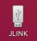

- 执行构建命令时，只需在命令最后加上 sd :

  ```
  make BOARD=pca10056 SD=s140 sd
  ```

  若已经在3.4节构建完成，可再次执行以上构建命令。

  在构建完成之后，便会自动调用nrfjprog工具，对板子进行擦除，烧录Softdevice，烧录mpy固件，复位操作：

  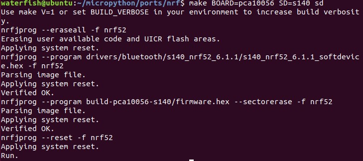

  

**2. 手动方式烧录固件**

首先分析nrfjprog的烧录过程

第一步，将板子flash完全擦除：

```
nrfjprog --eraseall -f nrf52
```

第二步，烧录6.1.1版本的softdevice蓝牙协议栈：

```
nrfjprog --program drivers/bluetooth/s140_nrf52_6.1.1/s140_nrf52_6.1.1_softdevice.hex -f nrf52
```

第三步，烧录mpy固件：

```
nrfjprog --program build-pca10056-s140/firmware.hex --sectorerase -f nrf52
```

第四步，板子复位：

```
nrfjprog --reset -f nrf52
```

于是，我们手动方式烧录固件，实际上就是用其他烧录工具，重复以上操作：

- 将板子连上电脑，使用J-Flash Lite连接板子

  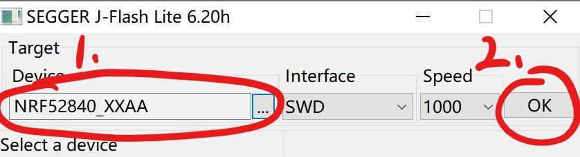

  

- 擦除芯片

  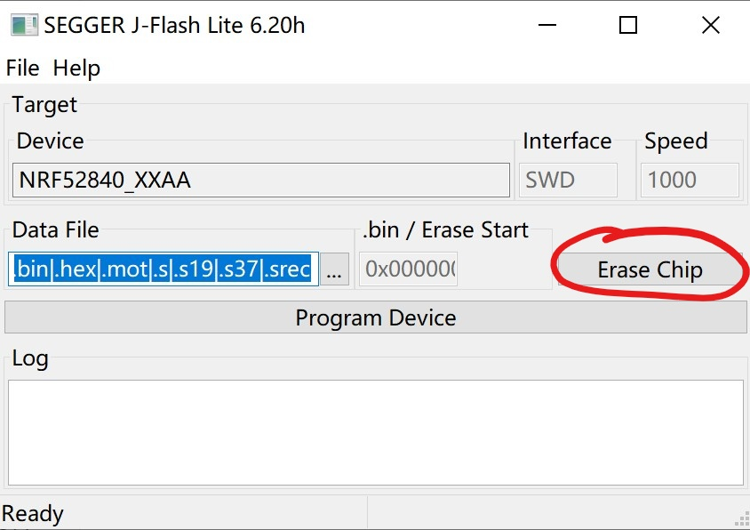

  

- 烧录s140 6.1.1版本（版本一定要对）的Sotfdevice（可以在ports/nrf/drivers/bluetooth/s140_nrf52_6.1.1下找到）

  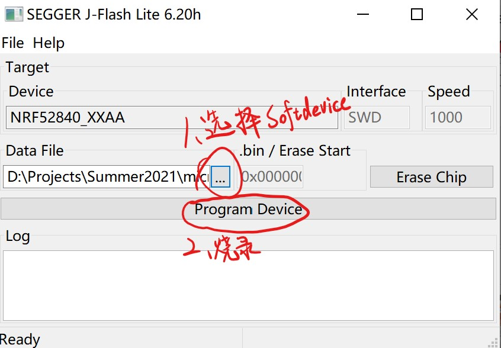

  

- 继续烧录刚刚构建好的mpy固件，firmware.hex

  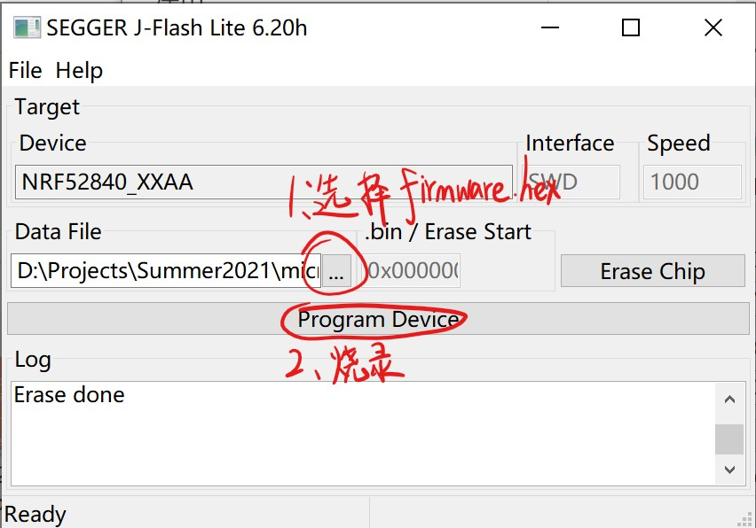

  

- 按一下板上的复位按钮。

### 五、连接板子并测试

1. 使用putty连接板子，波特率选择115200，按 Ctrl + B 或 Ctrl + D 将会看到输出信息：

   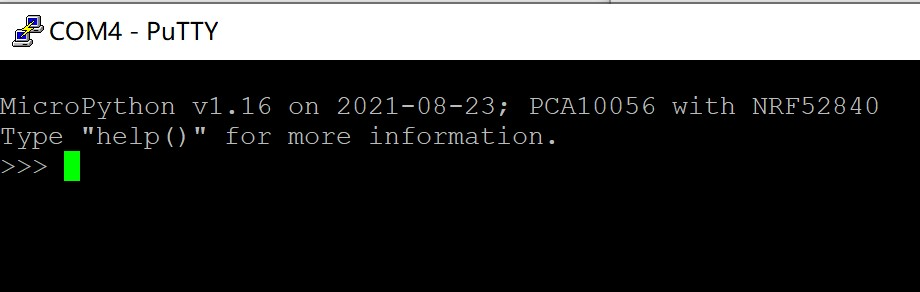

2. 输入以下命令，并回车

   ```
   help("modules")
   ```

   在打印出来的模块名中，若能找到 ubluepy ，则表示 ble 模块成功构建进固件中：

   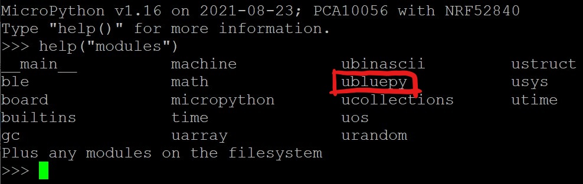

   此时，继续输入:

   ```
   import ubluepy
   ```

   若无报错，则表示模块成功导入。

至此，pca10056带ble模块的mpy固件编译与烧录完成！


### 六、后记与踩过的坑

本次pca10056固件的编译过程其实相对顺利，只是问题出在烧录过程。

板子连上电脑后，会出现一个名叫JLINK的虚拟硬盘，这与STM32的NUCLEO板子连上电脑后会出现一个虚拟硬盘一样，把.bin文件拖入这个虚拟硬盘，固件将会自动烧录进去。我以前烧录mpy固件就是这么做的，因为比较方便。这次也不例外，当我把不带ble的pca10056固件烧录进去后，mpy能正常启动，putty能打印出mpy信息。我以为这样操作是没问题的。

但是当我把带ble模块的mpy固件烧录好，把.bin文件拖进去烧录之后，mpy却不能跑起来。起初我以为是master分支下有bug，毕竟这部分用的人少，论坛基本搜不到相关编译，烧录和使用的过程，于是我将tag往回切，一个一个地切，一个一个地重新构建，烧录，直到tag太旧，已经404了，依然不能启动。

于是我在issues里翻记录，在mpy官方论坛里面搜索，发现其实即便是在最新的v1.16版本，依然有相关提交，论坛也有零星的相关讨论。于是我断定，固件应该是没问题的，问题出在其他地方。

我猜测softdevice可能不包含在固件内（之前一直认为softdevice在编译链接时便包含在固件里面）。于是先完全擦除板上flash，然后借用RT-Thread的MDK工程，烧录softdevice，然后再继续将.bin文件拖到虚拟硬盘中烧录固件。但这依然不起作用。

后来，我发现官方论坛里烧录成功的例子，都是在构建的时候，命令最后面加上sd，使得工程在构建完之后，自动调用nrfjprog工具进行烧录。于是我尝试把nrfjprog工具装上，重新构建，并在命令最后加上sd，使工程自动烧录。

结果如我所想地成功了，我仔细看了一下，总共调用四条nrfjprog的命令，分别是擦除芯片，烧录softdevice，烧录固件以及复位，但这和我之前烧录过程无异，这让我产生疑惑。

最后，在导师@[supperthomas](https://github.com/supperthomas)的指导下了解到，烧录softdevice后再烧录的固件需要偏移一个地址，.hex文件是带偏移地址的，而.bin文件是不带偏移地址的，直接拖入.bin文件烧录固件这种操作会覆盖softdevice，造成mpy固件无法启动，直接把.bin文件拖到JLINK的虚拟硬盘烧录，这种方法不推荐使用，非常规做法。

然后，我使用JLINK-Lite（J-Flash报盗版错误，无法连接）重复nrfjprog的几条操作，mpy正常启动，并能import ubluepy。至此，坑填好了。

