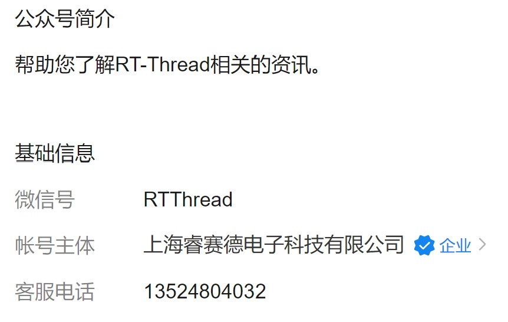

# 简单入门BSAL

> 这篇文章其实是对我过去三个月所了解到的，关于 BLE，nimble 协议栈，Softdevice 协议栈和 BSAL 等相关知识的总结，算是一个从0到1的过程了，希望能对有相关问题的同学有帮助。

### 一、BLE 协议栈

​		对于 BLE 的理解可以从这里的[文档](https://supperthomas-wiki.readthedocs.io/en/latest/ble/index.html)开始。BLE STACK篇详细讲解了 BLE 的相关知识，甚至包括物理上电磁波如何传数据等等。这些是偏向于底层的东西了，如果单纯写应用的话，这部分不需要太深入（实际上我也一知半解）。因此，我在这里归纳总结一些对后面写应用有帮助的东西。

#### 1.1 BLE 角色

​		一讲到通信，就离不开设备于设备之间的关系的问题，我们写应用就需要正确认识到自己开发的设备在通信中担任什么角色。

1. Broadcaster role：广播角色，只发送广播数据，让其他设备发现自己。
2. Observer role：观察角色，只接收广播数据，能发现其他正在发广播数据的设备。
3. Peripheral role：外围角色，相当于从设备，处理来自主设备的读写请求。
4. Central role：中心角色，相当于主设备，能够对从设备发起读写请求


​		想象一个场景：上世纪90年代，改革开放的步伐已经迈开。深圳某人才招聘市场中，人流涌动，热火朝天。来自各行各业的老板（Broadcaster role）西装革履，左手捏着一沓传单，右手拿着一个“大声公”喊道：“某某公司诚招电子工程师，月薪……”（发送广播数据）来到这里的，还有不少刚毕业，从外地来的大学生（Observer role），他们眼观六路，耳听八方，仔细看着一张张招聘传单，同时也不放过来自不同方向的招聘声音（接收广播数据）。当他们看到他们想要的工作时，便去到那个公司的摊位，坐下来跟 HR 开始聊（建立连接）。通常，大学生们（Central role）会比较关注薪资，坐下来的第一件事就是问 HR 薪资能给多少（发起读写请求）。对方 HR（Peripheral role）也不是等闲之辈，面对这么直接的应聘者，通常会把薪资往上了说（处理读写请求），争取更多的周旋空间……

​		通过上面的故事，我想说的是，一个设备是没有固定说自己只能担任 BLE 里的哪一个角色。在广播阶段，一个设备打广播，一个设备监听广播；监听者选择了一个设备建立连接之后，广播者变成了从设备，监听者变成了主设备。也就是说，设备所处的应用场景不同，担任的角色也会转变。


#### 1.2 协议栈与硬件的关系

​		以前总是听说，某某芯片跑什么什么协议栈，让我一直以为协议栈是和硬件有关系的，不同家芯片的协议栈不能跑得通。但实际上并不是这样的，协议栈是脱离硬件，软件层面的东西，最终目的都是构建出一些 BLE 的数据结构，然后调用底层芯片外设的 API 将数据发送出去。不论用什么协议栈，发送出去的数据都应遵守 BLE 的规范。

​		例如 Softdevice、nimble 和 realtek 等等，虽然协议栈不一样，用他们的芯片可能也不一样，但是只要执行同一套 BLE 规范，实现同一个 BLE 服务，那么最终芯片发出去的数据包将会是一样的。因此不同协议栈理所应当可以互相通信。

​		既然如此，我很好奇既然发出去的数据包都是一样的，为何大家不共同维护同一套协议栈。导师给我的回答是，厂商用自家的协议栈，出问题了也好自己解决……于是有了 BSAL 这个蓝牙协议栈抽象层，目的是向下屏蔽各种协议栈接口，向上给 app 提供统一接口。


### 二、Profile 是什么

​		虽然 Profile 是什么东西，有什么作用这个问题困扰过我一段时间。但其实很好理解。Profile 是用来描述 Service 的，比如描述这个 Service 的 UUID，以及有什么特性，有什么功能等等。生搬硬套地讲，可能还是有点晦涩，还是打比方吧，以 GATT 为例：

​		一个 Service 就像微信里面的一个公众号、服务号，Profile 就是用来描述公众号里面有什么功能。比如我关注了“RTThread物联网操作系统”，公众号的微信号，就是这个 Service 的 UUID：



​		公众号对话框下面有“教程资料”、“互动专区”和“关于RTT”三个可点按钮，这就相当于 Service 里的特性（Characteristic），而这三个的名字就相当于特性的 UUID：


​		很明显，这里的特性现在是可读不可写的状态，点击（读取）其中一个，便会弹出一列菜单，这些就是特性里的值：


​		当你关注公众号之后，默认你会接收来自公众号的消息（notify），于是公众号每天都会推送一些干货资料给你。当你不需要公众号推送这些消息时，可以将公众号的接收消息项关闭掉（CCCD）。***注意：**这里需要转换一下，CCCD 全称是 Client Characteristic Configuration Description，是 Service 里的特性的一个属性。微信公众号这个举例，是将整个 Service 的消息通知关闭，而 CCCD 则仅仅是修改某一个特性是否推送消息：


​		在 BLE 中，有许多由蓝牙技术联盟制定的服务[规范](https://www.bluetooth.com/specifications/specs/)（SPEC），比如用于显示电池状态的 BAS，显示设备信息的 DIS，显示心率信息的 HRS 等等。规范中规定了，Service 的 UUID，需要有哪些特性，特性的 UUID，读写权限等等。在写一份 Profile 的时候，要尽可能地遵守相关的 SPEC。

​		一个设备当然不可能只跑一个 Service，比如一个智能蓝牙手环，很可能就会同时有 BAS，DIS 和 HRS。这就相当于，在学校里想要关注某个学院的信息，就会关注学院微信公众号，学生会微信公众号，以及一些实验室微信公众号一样。当一个服务需要其他服务协助完成一个功能，就会用到 include 功能，但这一般比较少见，一个服务只需要专注于自己的服务就好了，如果应用有其他服务的需求，就由 app 层去引入。


### 三、一个重要的开发手段——BLE 抓包

​		讲了两个章节，依然感觉是一些很虚的东西，都是一些流窜于各个 c 文件之间的结构体变量，函数，很模糊的代码。因此我们需要一个抓包工具，虚往实归，来看看数据在空气中传播的数据是怎样的。

​		[参考文档](https://supperthomas-wiki.readthedocs.io/en/latest/03_xupenghu/04_btsnoop_hci/android_hci.html)，安装好后便可以用手机对我们想探明虚实的数据进行抓包。这里我抓下来一份 HRS 的包，[跑的 sample 的 Profile 是这个](https://github.com/RT-Thread-packages/nimble/blob/master/apps/blehr/src/gatt_svr.c)：

- 首先来看看 sample 的代码，下面这个结构体表示了这个例程有 HRS 和 DIS 两个 Service，以及 Service 里面有哪些特性，HRS 包括了心率测量值和传感器位置，DIS 包括了生产商和型号：

  ```c
  static const struct ble_gatt_svc_def gatt_svr_svcs[] = {
      {
          /* Service: Heart-rate */
          .type = BLE_GATT_SVC_TYPE_PRIMARY,
          .uuid = BLE_UUID16_DECLARE(GATT_HRS_UUID),
          .characteristics = (struct ble_gatt_chr_def[]) { {
              /* Characteristic: Heart-rate measurement */
              .uuid = BLE_UUID16_DECLARE(GATT_HRS_MEASUREMENT_UUID),
              .access_cb = gatt_svr_chr_access_heart_rate,
              .val_handle = &hrs_hrm_handle,
              .flags = BLE_GATT_CHR_F_NOTIFY,
          }, {
              /* Characteristic: Body sensor location */
              .uuid = BLE_UUID16_DECLARE(GATT_HRS_BODY_SENSOR_LOC_UUID),
              .access_cb = gatt_svr_chr_access_heart_rate,
              .flags = BLE_GATT_CHR_F_READ,
          }, {
              0, /* No more characteristics in this service */
          }, }
      },
  
      {
          /* Service: Device Information */
          .type = BLE_GATT_SVC_TYPE_PRIMARY,
          .uuid = BLE_UUID16_DECLARE(GATT_DEVICE_INFO_UUID),
          .characteristics = (struct ble_gatt_chr_def[]) { {
              /* Characteristic: * Manufacturer name */
              .uuid = BLE_UUID16_DECLARE(GATT_MANUFACTURER_NAME_UUID),
              .access_cb = gatt_svr_chr_access_device_info,
              .flags = BLE_GATT_CHR_F_READ,
          }, {
              /* Characteristic: Model number string */
              .uuid = BLE_UUID16_DECLARE(GATT_MODEL_NUMBER_UUID),
              .access_cb = gatt_svr_chr_access_device_info,
              .flags = BLE_GATT_CHR_F_READ,
          }, {
              0, /* No more characteristics in this service */
          }, }
      },
  
          {
              0, /* No more services */
          },
  };
  ```


- 对应地，再来看看抓包抓出来啥东西（[.cfa文件地址](https://github.com/WaterFishJ/Summer2021_docs/blob/master/%E7%AE%80%E5%8D%95%E5%85%A5%E9%97%A8BSAL/btsnoop_hci_hrs.cfa)）：

  

  最左边列是帧序号，最右边列是数据传输方向，M 就是 Master，S 就是 Slaver，从这个方向列可以看出，两个设备在空气中有来有回。以帧作为序号，从第674帧开始逐帧分析**（写到第四节回来说一句，请仔细观察 Handle 值，这个值非常重要，相当于一个变量的指针，同时这个值是由 S 设备初始化协议栈时决定的）**：

  - 674：M 向 S 问有什么重要的 Service

  - 677：S 向 M 回答有一个 HRS 和一个 DIS，点击这一帧，左侧会显示信息，这里还要注意 Attribute Handle 的值，标志着 Service 的位置：

    

    

  - 678：M 向 S 问，HRS 有没有 Include 其他服务的需求，请注意看这里的 Attribute Handle 值，对应 HRS 的值，这些值在上一帧中被 S 告知（以下同理注意这些 Handle 值）：

    

  - 680：S 向 M 回答没有

  - 681：M 向 S 问 HRS 有什么特性：

    

  - 683：S 向 M回答，有心率测量值和身体传感器位置这两个特性：

    

  - 685：M 向 S 问 HRS 还有没有别的特性

  - 687：S 向 M 回答没有了

  - 688：M 向 S 问关于 HRS 的 Handle 4 有没有什么信息说明，因为 Handle 2、3、5、6（Attribute Handle、Value Handle）均有说明，唯独少了4。

    

  - 690：S 向 M 回答 Handle 4的 UUID 是 0x0229，也就是 Client Characteristic Configuration，也就是 CCCD：

    

  - 691-702：重复上面的过程，向 DIS 询问一些相关问题。（跟 HRS 一样，限于篇幅就不展开了）

  - 706-708：M 向 S 写了一个值，这个值的目标地址是 Handle 4，也就是 HRS 的一个 CCCD，值是 0x0100，意思就是告诉设备，可以向我通知（notify）这个特性的值了，随后 S 回复，表示收到消息：

    

  - 709-713：S 定时地，不断地向 M 发送心率测量数据

    

  - 714-716：M 向 S 写了一个值，这个值的目标地址是 Handle 4，也就是 HRS 的一个 CCCD，值是 0x0000，意思就是告诉设备，不要向我通知（notify）这个特性的值了，随后 S 回复，表示收到消息，后面便不再向 M 发送心率测量数据了：

    

  - 717：M 向 S 请求读取身体传感器位置这个值（Handle 6）:

    

  - 719：S 向 M 回复，身体传感器这个特性的值是0x01，即代表传感器位置在胸口：

    
  
  - 后面关于 DIS 的包没有抓，但是原理跟 HRS 的一样，限于篇幅就不展开说了。

​		抓包分析下来后，我们发现，代码上写的东西，在数据包中都能一一找到，虚的东西变成实的，云开雾散，看到了数据的真面目。因此，在写一个新的服务，或者移植一个旧的服务到 BSAL 时，抓包分析这个手段就显得尤其重要了。


###  四、以 HRS 为例分析如何实现一个 Service

#### 4.1 HRS 是什么

​		全称是 Heart Rate Service，心率服务，是一个关于心率测量数据、心率传感器数据以何种数据格式进行传递的一个规范。首先给出 [SPEC](https://www.bluetooth.com/specifications/specs/heart-rate-service-1-0/)，[翻译版本](https://supperthomas-wiki.readthedocs.io/en/latest/ble_profile/03_heart_rate_profile/heart_tate_profile.html)，这是由蓝牙技术联盟制定的关于心率服务的规范。规范中有几个重点：

- 该服务不依赖其他服务（也就是不需要 Include）

- 该服务将提供以下四个特性：

  

  其中，心率测量和心率测量客户端特性配置描述符（CCCD）是必须要有的（要求M），身体传感器位置和心率测量点不是必须的。

- 心率测量数据包含四个数据：一个 flag 数据、一个心率数据、一个能量消耗数据和一个 RR间隔。而其中，flag数据的各个位还分别代表了：心率值格式位、传感器接触状态位、能量消耗状态位和 RR 间隔位。

- 因为心率测量数据对时间比较敏感，所以因各种原因导致未能及时发送的数据，应当被丢弃。


#### 4.2  HRS 的 Porfile 在 Softdevice，nimble，bsal 中是如何实现的

​		三个 sample 中都给 HRS 配置了心率测量、心率测量客户端特性配置描述符和身体传感器位置这三个特性，因此在他们的 Profile 中都分为三步走。

​		**第一步**是配置 Service 的 UUID 和其他属性，将 Service 的 UUID 配置为0x180D，也就是心率测量的 ID（[这些 UUID 也是由蓝牙技术联盟制定的](https://btprodspecificationrefs.blob.core.windows.net/assigned-values/16-bit%20UUID%20Numbers%20Document.pdf)，在协议栈里面已经编写成宏，并保存在一些头文件内）；**第二步**是配置心率测量特性，并给该特性增加一个可配置的 CCCD；**第三步**是配置身体传感器位置特性。实际上代码量会比较多，这里只摘最关键的一些地方：

- **第一步，Service：**

  - 在 Softdevice 中：

    ```c
    // Add service
        BLE_UUID_BLE_ASSIGN(ble_uuid, BLE_UUID_HEART_RATE_SERVICE);
    
        err_code = sd_ble_gatts_service_add(BLE_GATTS_SRVC_TYPE_PRIMARY,
                                            &ble_uuid,
                                            &p_hrs->service_handle);
    ```

  - 在 nimble 中，所有要配置的东西都写在一个结构体数组变量里：

    ```c
    static const struct ble_gatt_svc_def gatt_svr_svcs[] = {
        {
            /* Service: Heart-rate */
            .type = BLE_GATT_SVC_TYPE_PRIMARY,
            .uuid = BLE_UUID16_DECLARE(GATT_HRS_UUID),
    ```

  - 在 bsal 中，与 nimble 相似，也是用到一个结构体数组变量：

    ```c
    struct bsal_gatt_app_srv_def ble_svc_hrs_defs[] =
        {
            {
                /*** Heart Rate Service. */
                .type = BSAL_GATT_UUID_PRIMARY_SERVICE,
                .uuid = BSAL_UUID16_DECLARE(GATT_UUID_HEART_RATE),
    ```

- **第二步，心率测量特性：**

  - 在 Softdevice 中：

    ```c
        // Add heart rate measurement characteristic
        memset(&add_char_params, 0, sizeof(add_char_params));
    
        add_char_params.uuid              = BLE_UUID_HEART_RATE_MEASUREMENT_CHAR;
        add_char_params.max_len           = MAX_HRM_LEN;
        add_char_params.init_len          = hrm_encode(p_hrs, INITIAL_VALUE_HRM, encoded_initial_hrm);
        add_char_params.p_init_value      = encoded_initial_hrm;
        add_char_params.is_var_len        = true;
        add_char_params.char_props.notify = 1;
        add_char_params.cccd_write_access = p_hrs_init->hrm_cccd_wr_sec;
    
        err_code = characteristic_add(p_hrs->service_handle, &add_char_params, &(p_hrs->hrm_handles));
    ```

  - 在 nimble 中，特性是 Service 结构体变量的一个属性：

    ```c
    .characteristics = (struct ble_gatt_chr_def[]) { {
                /* Characteristic: Heart-rate measurement */
                .uuid = BLE_UUID16_DECLARE(GATT_HRS_MEASUREMENT_UUID),
                .access_cb = gatt_svr_chr_access_heart_rate,
                .val_handle = &hrs_hrm_handle,
                .flags = BLE_GATT_CHR_F_NOTIFY,
            },
    ```

  - 在 bsal 中，跟 nimble 相似：

    ```c
    .characteristics = (bsal_gatt_chr_def_t[])
                {
                    {
                        /*** Heart Rate Measurement characteristic */
                        .uuid = BSAL_UUID16_DECLARE(GATT_UUID_HRS_MEASUREMENT),
                        .properties = BSAL_ATT_P_NOTIFY,
                        .val_handle = &hrs_hrm_handle,
                        .permission = BSAL_GATT_PERM_READ_NONE,
                        .value_length = 1,
                    },
    ```

- **第三步，身体传感器位置特性：**

  - 在 Softdevice 中：

    ```c
    // Add body sensor location characteristic
            memset(&add_char_params, 0, sizeof(add_char_params));
    
            add_char_params.uuid            = BLE_UUID_BODY_SENSOR_LOCATION_CHAR;
            add_char_params.max_len         = sizeof(uint8_t);
            add_char_params.init_len        = sizeof(uint8_t);
            add_char_params.p_init_value    = p_hrs_init->p_body_sensor_location;
            add_char_params.char_props.read = 1;
            add_char_params.read_access     = p_hrs_init->bsl_rd_sec;
    
            err_code = characteristic_add(p_hrs->service_handle, &add_char_params, &(p_hrs->bsl_handles));
    ```

  - 在 nimble 中：

    ```c
    {
                /* Characteristic: Body sensor location */
                .uuid = BLE_UUID16_DECLARE(GATT_HRS_BODY_SENSOR_LOC_UUID),
                .access_cb = gatt_svr_chr_access_heart_rate,
                .flags = BLE_GATT_CHR_F_READ,
            }, 
    
    ble_gatts_add_svcs(gatt_svr_svcs);
    ```
    
    - 在 bsal 中：
  
      ```c
      {
                          /*** Body Sensor Location characteristic */
                          .uuid = BSAL_UUID16_DECLARE(GATT_UUID_CHAR_BODY_SENSOR_LOCATION),
                          .properties = BSAL_ATT_P_READ,
                          .val_handle = &hrs_hrm_handle,
                          .permission = BSAL_GATT_PERM_READ_NONE,
                          .value_length = 1,
                      },
      
      bsal_stack_le_srv_reg_func(stack_ptr, &ble_svc_hrs_defs, (P_SRV_GENERAL_CB *)profile_callback);
      ```
  

​		简单对比三份代码，可以看出来，配置方法都是大同小异，因为大家都是按照 SPEC 去执行，规范中有规定的，在代码里就能找到。

​		因此，当我们需要移植一份 Profile 的时候，我们就用三个重要的可以参考的东西：SPEC，抓包数据，其他协议栈的实现。


#### 4.3 除了构建出 Profile，还需要实现哪些功能

##### 4.3.1 实现 Profile 中断函数

​		在第三节中，两台设备刚建立连接时（674-702帧），M 与 S 之间的数据包有来有回，一个问一个答。实际上这个过程是不需要用户参与的，全程由协议栈一手操办。

​		从706帧开始，之后 M 向 S 的读写请求，就需要用户介入处理了。第706帧中，M 向 S 发送写请求，请求修改一个 CCCD 值。S 收到数据之后，在应用上需要做出对应的修改。第717帧中，M 向 S 发送一个读请求，请求读取身体传感器位置这一特性的值。S 收到请求后，向 M 发送了对应数据。

​		以 BSAL 为例，以上 M 对 S 的请求，都会以中断的形式向上传给应用层。用户需要在中断中对 BSAL 传上来的数据进行判断和处理，这一部分需要我们来实现。

​		以下列出的四种中断类型就是我们要进行处理的：

```c
typedef enum
{
    BSAL_CALLBACK_TYPE_READ_CHAR_VALUE = 1,              /**< client read event */
    BSAL_CALLBACK_TYPE_WRITE_CHAR_VALUE = 2,             /**< client write event */
    BSAL_CALLBACK_TYPE_INDIFICATION_NOTIFICATION = 3,    /**< CCCD update event */
    BSAL_CALLBACK_TYPE_HANDLE_TABLE = 4,                 /**< handle event */
} T_BSAL_SRV_CB_TYPE;
```

​		HRS 中，M 向 S 修改 CCCD 数据时，便会触发 BSAL_CALLBACK_TYPE_INDIFICATION_NOTIFICATION 这一事件的中断（注意这不是写中断）；M 向 S 读取身体传感器位置信息时，便会触发 BSAL_CALLBACK_TYPE_READ_CHAR_VALUE 中断。其他两个中断类型没有用到，因此我们只需要解决这两个事件即可：

```c
/* Sensor location, set to "Chest" */
static uint8_t body_sens_loc = BODY_SENSOR_LOCATION_CHEST;

static void hrs_profile_callback(void *p)
{
    bsal_callbak_data_t *p_param = (bsal_callbak_data_t *)p;
    bool is_app_cb = false;

    if (p_param->msg_type == BSAL_CALLBACK_TYPE_READ_CHAR_VALUE)
    {
        if (GATT_SVC_BODY_SENSOR_LOCATION_READ_INDEX == p_param->off_handle)
        {
            is_app_cb = true;
            bsal_srv_write_data(p_param->stack_ptr, p_param->start_handle, p_param->off_handle, sizeof(uint8_t), &body_sens_loc);
        }
    }
    else if (p_param->msg_type == BSAL_CALLBACK_TYPE_INDIFICATION_NOTIFICATION)
    {
        if (GATT_SVC_HRS_MEASUREMENT_CHAR_CCCD_INDEX == p_param->off_handle)
        {
            if (p_param->length == 2)
            {
                is_app_cb = true;
            }
        }
    }
    if (is_app_cb && (pfn_bas_cb != NULL))
    {
        pfn_bas_cb(p_param);
    }
}

```

​		当中断事件是：

- BSAL_CALLBACK_TYPE_READ_CHAR_VALUE时：因为一个 Service 可能会有不止一个特性能产生读中断事件，所以，惯例先判断读中断事件是由 HRS 的哪个特性传上来的。判断是身体传感器位置特性传上来的之后，便发送这个特性的值给 M。
- BSAL_CALLBACK_TYPE_INDIFICATION_NOTIFICATION时，同理先判断一下是不是心率测量客户端特性配置描述符传上来的，如果是再判断数据长度是否正确，如果正确则打开 app 回调函数，这个数据需要让 app 去处理。


##### 4.3.2 确定 handle 值以及实现 notify 函数

​		因为 HRS 具有向主设备 notify 数据的能力，所以我们要实现这一条函数，给 app 调用。在4.1节中 HRS 的描述便可知，要 notify 的数据是心率测量特性的数据。同时经过第三节的抓包分析，我们知道，心率测量特性的 Handle 值是3，发送心率测量特性数据等同于发送 Handle 3的数据。

​		问题来了，如果不抓包，我们怎么知道心率测量特性的 Handle 值是3呢？首先，心率测量特性是 HRS 的一个特性，而 HRS 是被注册到协议栈里面的，协议栈里面可能同时还有其他 Service，因此我们首先需要找到 HRS 的 Start Handle 值：

```c
bsal_uuid_any_t uuid_srv;
uuid_srv.u_type = 16;
uuid_srv.u16.value = GATT_UUID_HEART_RATE;
uint16_t start_handle = bsal_srv_get_start_handle(stack_ptr, uuid_srv);
```

​		找到 HRS 的 Start Handle 值，我们就要找心率测量特性的 Handle 值了。在 bsal 的代码中我们其实可以粗略看出来，对比一下抓包数据，可以发现：设 Service 的 Handle 为1，向下看，心率测量特性的 handle 则为2，心率测量特性的值的 Handle 即为3。

```c
    struct bsal_gatt_app_srv_def ble_svc_hrs_defs[] =
    {
        {
            /*** Heart Rate Service. */
            .type = BSAL_GATT_UUID_PRIMARY_SERVICE,
            .uuid = BSAL_UUID16_DECLARE(GATT_UUID_HEART_RATE),//handle 1
            .characteristics = (bsal_gatt_chr_def_t[])
            {
                {
                    /*** Heart Rate Measurement characteristic */
                    .uuid = BSAL_UUID16_DECLARE(GATT_UUID_HRS_MEASUREMENT),//handle 2
                    .properties = BSAL_ATT_P_NOTIFY,
                    .val_handle = &hrs_hrm_handle,
                    .permission = BSAL_GATT_PERM_READ_NONE,
                    .value_length = 1,
                },
```


​		这样就可以得出来，这个值的 Handle 值相对 Service 的 Handle 值偏移量为（3 - 1 = 2）。

​		综上，我们首先得到了 HRS 的 Start Handle，然后又得到了心率测量特性的值相对于 HRS 的 Start Handle 的偏移量，也就能的出来心率测量特性的值在协议栈中的位置，于是可以召唤 bsal 的 notify 函数，发送数据了：

```c
#define GATT_SVC_HRS_MEASUREMENT_CHAR_INDEX		2

bsal_srv_send_notify_data(stack_ptr, conn_id, start_handle, GATT_SVC_HRS_MEASUREMENT_CHAR_INDEX, sizeof(hr_measurement), hr_measurement);
```

​		以上这个过程，能清晰地解释如何去找 Handle 值。理解之后，其实还有一种更快捷的方法推荐大家使用，就是先放着这条函数不管，直接抓包。然后对比其中的 Handle 值就可以了。（在此，我觉得 bsal 层应像获取 Service 的 Start Handle 值一样，提供一条函数计算各种 Handle 才是比较好的解决方案）


### 五、在 pca10056 开发板中跑起来 BSAL 层

在 [rt-thread 的 bsp 中](https://github.com/RT-Thread/rt-thread/tree/master/bsp/nrf5x/nrf52840)打开 env，进入 menuconfig，选择 nimble 协议栈：


然后选择 bsal 包：


进入 bsal 包配置，随便选择一个 sample（我这里选了 uart sample），协议栈选择 nimble，版本选择 latest：


保存并退出 menuconfig，执行 pkgs --update 命令，将 bsal，nimble 等各种包下载下来。随后执行 scons --target=mdk5，生成 MDK5 工程。

打开 MDK5 工程后，不要急着编译，在工程配置里面打开 GNU 项，再进行编译，否则编译不通过（最新版本已修复）：


编译通过后，连接 pca10056 开发板，并下载程序到板上，连接 MSH 后输入命令 bsal_nus_app 并按回车，BSAL 程序便跑起来了：


此时，手机打开 nRF Connect，便能搜索到 “ble_rtt_uart” 这个设备：


### 六、应用层中启动 BSAL 的流程

​		在应用层中，bsal 的使用有点类似系统中的一个设备。

1. 首先需要按协议栈名去查找一个协议栈，类似于按设备名查找设备，并返回一个设备句柄：

```c
void *bsal_find_stack_ptr(char *stack_name)
```

2. 查找到协议栈之后，要对协议栈初始化：

```c
int bsal_stack_init(void *stack_ptr, void *callback)
```

3. 初始化好协议栈之后，要设置一个广播名字，就是在广播时，要显示一个什么名字：

```c
int bsal_set_device_name(void *stack_ptr, uint8_t length, uint8_t *name)
```

4. 然后，需要绑定类型（这一条函数我还没理解，照着做就好了）：

```c
uint16_t bsal_set_device_le_bond_type(void *stack_ptr, bool is_bond, uint8_t input, uint8_t output, uint8_t bond_type, bool oob_enable)
```

​	5. 通知协议栈，要开始注册 Profile 进去：

```c
void bsal_stack_le_srv_begin(void *stack_ptr, uint8_t num, void *p_fun_cb)
```

​	6. 执行 Profile 的初始化函数，也就是4.2节中的函数，比如：

```c
void bsal_le_hrs_svr_init(void *stack_ptr, void *app_callback)
```

​	7. 通知协议栈，Profile 已经注册完了：

```c
void bsal_stack_le_srv_end(void *stack_ptr)
```

​	8. 启动协议栈：

```c
void bsal_stack_startup(void *stack_ptr)
```

​		凡是要启动 bsal，都需要这样的流程，照着写就对了，甚至是可以从其他 bsal sample 上 复制粘贴过来用（我一直都这样哈哈）。最后启动协议栈如果顺利的话，那么 bsal 就是顺利跑起来了，你的 Service 也成功注册到协议栈里了，bsal 层上的工作基本完成，接下来就看应用层了。


### 七、各种可参考的 BSAL sample

首先是 Profile，这个[Github 链接](https://github.com/RT-Thread-packages/bsal/tree/main/profiles/service)，里面存放有部分我写的 Profile：

- bsal_dis：设备信息服务
- bsal_hrs：心率测量服务
- bsal_lbs：Nordic 的 LED Button 服务
- bsal_uart：Nordic 的 Uart 服务

然后是 sample， 这个[Github链接](https://github.com/RT-Thread-packages/bsal/tree/main/samples)，里面存放有我写的部分 Sample：

- ble_hrs_app.c：心率测量的 sample
- ble_lbs_app.c：Nordic 的 Blinky sample，手机安装 nRF Blinky 程序，就能对板子上的 LED 灯进行控制，也能读取板载按钮的状态
- ble_nus_app.c：Nordic 的 Uart sample


